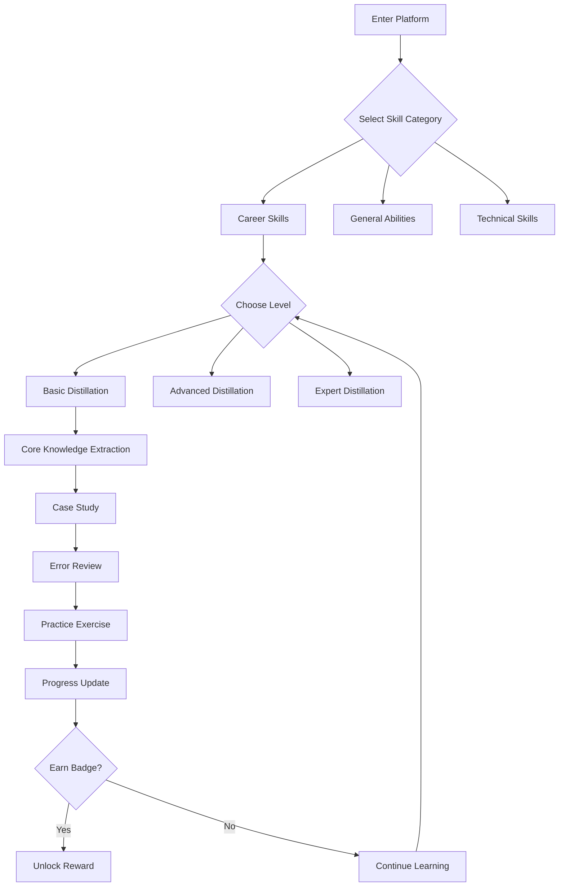

## 1. Product Overview

一款专注技能蒸馏赋能的在线学习平台，旨在摒弃冗余知识，聚焦核心能力沉淀，为用户提供高效化的skill蒸馏体验。无需注册登录即可使用，支持分层学习体系、个性化路径推荐和社区激励系统。

## 2. Core Features

### 2.1 User Roles
| Role | Registration Method | Core Permissions |
|------|---------------------|------------------|
| Anonymous User | None | Access all core learning features |
| Active Learner | None | Earn badges, track progress |

### 2.2 Feature Modules

1. **Home Page**: Hero section, skill categories, featured distillation courses
2. **Skill Categories**: Career core skills, general abilities, technical skills
3. **Distillation Learning**: Hierarchical learning system (Basic/Advanced/Expert)
4. **Progress Tracking**: Real-time progress, weakness marking, visualization
5. **Community**: Experience sharing, discussions, achievement badges

### 2.3 Page Details

| Page Name | Module Name | Feature Description |
|-----------|-------------|---------------------|
| Home Page | Hero Section | Animated banner showcasing platform value proposition |
| Home Page | Skill Categories | Three main skill domains with quick access |
| Home Page | Featured Courses | Top distillation courses carousel |
| Learning Hub | Hierarchical System | Three levels: Basic/Advanced/Expert distillation |
| Learning Hub | Immersive Modules | Core knowledge extraction, case studies, error review, practice |
| Progress Center | Tracking Dashboard | Real-time progress bars, weakness indicators |
| Progress Center | Visualization | Charts showing distillation effectiveness |
| Community | Discussion Forum | Experience sharing, peer communication |
| Community | Achievement System | Badges and progression rewards |

## 3. Core Process

## 4. User Interface Design

### 4.1 Design Style
- **Primary Color**: Deep indigo (#3B82F6) with gradient accents
- **Secondary Color**: Emerald green (#10B981) for success states
- **Button Style**: Modern rounded corners with hover animations
- **Font**: Inter - clean, modern sans-serif
- **Layout**: Card-based design with generous whitespace
- **Icon Style**: Lucide icons - clean, consistent line style

### 4.2 Page Design Overview

| Page Name | Module Name | UI Elements |
|-----------|-------------|-------------|
| Home Page | Hero Section | Large gradient background, animated skill icons floating |
| Home Page | Skill Categories | Three large cards with icons, hover scaling effect |
| Learning Hub | Level Selection | Tab navigation with progress indicators |
| Learning Hub | Content Area | Knowledge cards with expandable details |
| Progress Center | Dashboard | Circular progress rings, bar charts, heat maps |
| Community | Badge Display | Grid layout with animated badge reveal |

### 4.3 Responsiveness
- Desktop-first approach with mobile adaptation
- Touch-optimized buttons and navigation for mobile
- Collapsible navigation menu on smaller screens

### 4.4 Branding Elements
- Distillation-themed visual metaphors (purification, condensation)
- Fluid animations representing knowledge refinement
- Progress indicators using liquid/flow visualizations