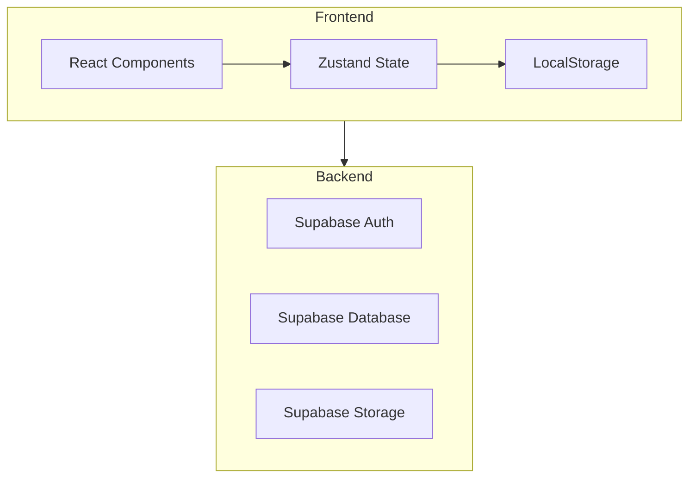
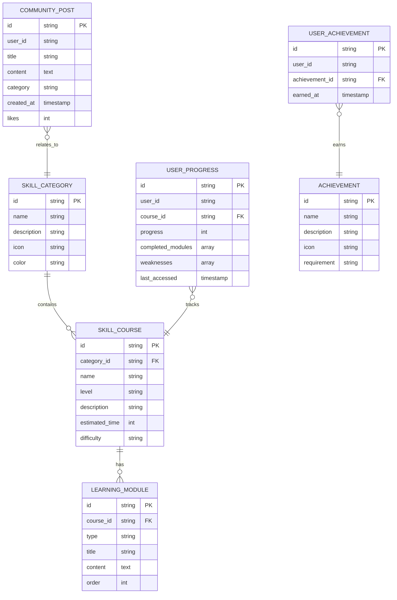

## 1. Architecture Design



## 2. Technology Description

- **Frontend**: React@18 + TypeScript + TailwindCSS@3 + Vite
- **State Management**: Zustand (lightweight, no registration needed)
- **Routing**: React Router DOM
- **Icons**: Lucide React
- **Charts**: Chart.js + react-chartjs-2
- **Backend**: Supabase (Database, Auth optional)
- **Storage**: LocalStorage for anonymous user progress

## 3. Route Definitions

| Route | Purpose | Component |
|-------|---------|-----------|
| / | Home page with hero and categories | HomePage |
| /learn | Learning hub with hierarchical system | LearningHub |
| /learn/:category | Specific skill category | CategoryPage |
| /learn/:category/:level | Specific level content | LevelPage |
| /progress | Progress tracking dashboard | ProgressCenter |
| /community | Community forum and achievements | CommunityPage |
| /recommend | Personalized recommendations | RecommendPage |

## 4. Data Model

### 4.1 Data Model Definition



### 4.2 Data Definition Language

```sql
-- Skill Categories
CREATE TABLE skill_categories (
    id TEXT PRIMARY KEY,
    name TEXT NOT NULL,
    description TEXT,
    icon TEXT,
    color TEXT
);

-- Skill Courses
CREATE TABLE skill_courses (
    id TEXT PRIMARY KEY,
    category_id TEXT REFERENCES skill_categories(id),
    name TEXT NOT NULL,
    level TEXT NOT NULL,
    description TEXT,
    estimated_time INTEGER,
    difficulty TEXT
);

-- Learning Modules
CREATE TABLE learning_modules (
    id TEXT PRIMARY KEY,
    course_id TEXT REFERENCES skill_courses(id),
    type TEXT NOT NULL,
    title TEXT NOT NULL,
    content TEXT,
    "order" INTEGER
);

-- User Progress (stored locally for anonymous users)
CREATE TABLE user_progress (
    id TEXT PRIMARY KEY,
    user_id TEXT NOT NULL,
    course_id TEXT REFERENCES skill_courses(id),
    progress INTEGER DEFAULT 0,
    completed_modules TEXT[],
    weaknesses TEXT[],
    last_accessed TIMESTAMP DEFAULT NOW()
);

-- Achievements
CREATE TABLE achievements (
    id TEXT PRIMARY KEY,
    name TEXT NOT NULL,
    description TEXT,
    icon TEXT,
    requirement TEXT
);

-- User Achievements
CREATE TABLE user_achievements (
    id TEXT PRIMARY KEY,
    user_id TEXT NOT NULL,
    achievement_id TEXT REFERENCES achievements(id),
    earned_at TIMESTAMP DEFAULT NOW()
);

-- Community Posts
CREATE TABLE community_posts (
    id TEXT PRIMARY KEY,
    user_id TEXT NOT NULL,
    title TEXT NOT NULL,
    content TEXT,
    category TEXT,
    created_at TIMESTAMP DEFAULT NOW(),
    likes INTEGER DEFAULT 0
);
```

## 5. State Management Structure

```typescript
interface AppState {
    // User session (anonymous)
    userId: string;
    sessionStarted: Date;
    
    // Progress tracking
    progress: Record<string, CourseProgress>;
    weaknesses: Weakness[];
    
    // Achievements
    earnedBadges: string[];
    
    // Learning preferences
    preferredCategories: string[];
    skillLevel: 'beginner' | 'intermediate' | 'advanced';
    
    // UI state
    activeTab: string;
    sidebarOpen: boolean;
}

interface CourseProgress {
    courseId: string;
    progress: number;
    completedModules: string[];
    lastAccessed: Date;
}

interface Weakness {
    courseId: string;
    moduleId: string;
    topic: string;
    confidence: number;
}
```

## 6. Component Structure

```
src/
├── components/
│   ├── layout/
│   │   ├── Header.tsx
│   │   ├── Sidebar.tsx
│   │   └── Footer.tsx
│   ├── home/
│   │   ├── HeroSection.tsx
│   │   ├── SkillCategories.tsx
│   │   └── FeaturedCourses.tsx
│   ├── learning/
│   │   ├── LevelSelector.tsx
│   │   ├── KnowledgeCard.tsx
│   │   ├── CaseStudy.tsx
│   │   └── PracticeExercise.tsx
│   ├── progress/
│   │   ├── ProgressDashboard.tsx
│   │   ├── WeaknessIndicator.tsx
│   │   └── VisualizationChart.tsx
│   ├── community/
│   │   ├── PostCard.tsx
│   │   ├── BadgeDisplay.tsx
│   │   └── DiscussionForm.tsx
│   └── common/
│       ├── Button.tsx
│       ├── Card.tsx
│       └── ProgressBar.tsx
├── pages/
│   ├── HomePage.tsx
│   ├── LearningHub.tsx
│   ├── CategoryPage.tsx
│   ├── LevelPage.tsx
│   ├── ProgressCenter.tsx
│   ├── CommunityPage.tsx
│   └── RecommendPage.tsx
├── store/
│   └── useAppStore.ts
├── data/
│   └── mockData.ts
├── utils/
│   └── helpers.ts
└── types/
    └── index.ts
```

## 7. Key Features Implementation

### 7.1 Anonymous User Support
- Generate unique UUID on first visit
- Store all progress in LocalStorage
- Sync to Supabase only when user chooses to create account

### 7.2 Hierarchical Distillation System
- Three levels: Basic (60% knowledge), Advanced (80% knowledge), Expert (100% knowledge)
- Prerequisite checks between levels
- Progress-based level unlocking

### 7.3 Immersive Modules
1. **Core Knowledge Extraction**: Key concepts highlighted with visual cues
2. **Case Study**: Real-world examples with interactive elements
3. **Error Review**: Common mistakes and corrections
4. **Practice Exercise**: Interactive quizzes and simulations

### 7.4 Personalized Recommendations
- Analyze user progress and preferences
- Recommend next skill based on weakness analysis
- Suggest complementary skills

### 7.5 Achievement System
- Badge-based rewards for completing courses
- Progressive difficulty unlocking
- Visual achievements showcase